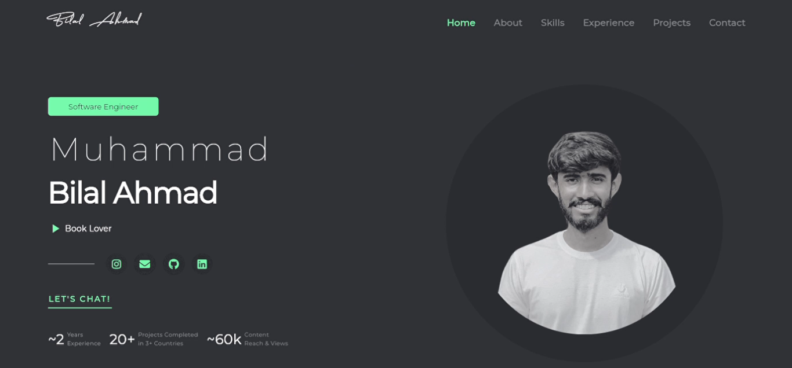
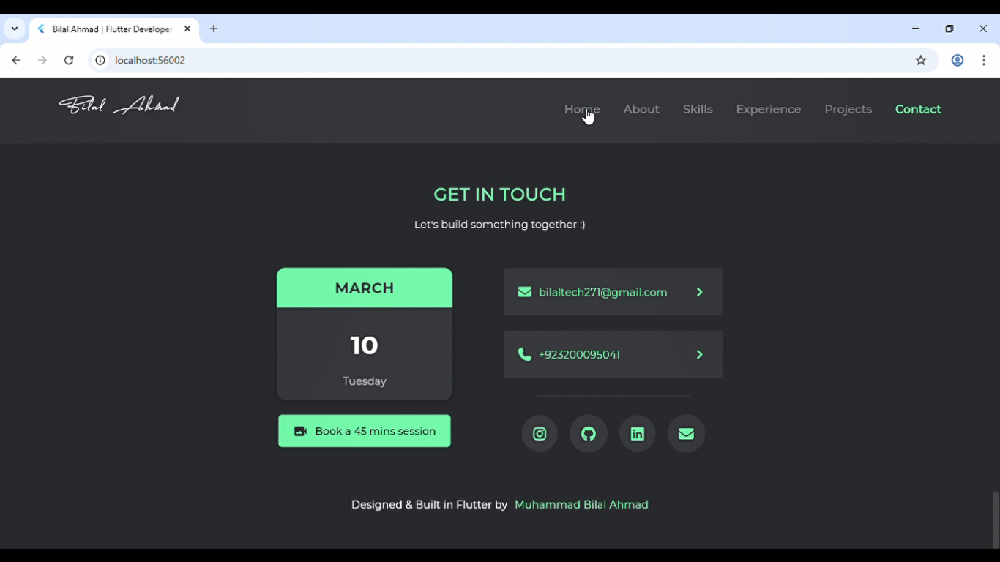

# flutter_portfolio_website

🚀 Flutter Portfolio Website

A modern, fully responsive Flutter portfolio website built to showcase my skills, projects, and experience as a Flutter Developer. This project is optimized for web, mobile, and tablet screens, ensuring a seamless user experience across all devices.

✨ Features

🔥 Fully Responsive Design (Mobile, Tablet, Desktop)

⚡ Fast Performance & Optimized UI

🎯 Clean and Modern User Interface

📂 Projects Showcase Section

👨‍💻 About Me & Skills Section

📞 Contact Section

🌐 Cross-platform (Single codebase for Web & Mobile)

🎨 Custom UI with smooth layout structure

## Getting Started

🛠️ Tech Stack

Flutter (Web & Mobile)

Dart

Responsive UI Design

Custom Widgets

Git & GitHub

This project is a starting point for a Flutter application.

A few resources to get you started if this is your first Flutter project:

- [Lab: Write your first Flutter app](https://docs.flutter.dev/get-started/codelab)
- [Cookbook: Useful Flutter samples](https://docs.flutter.dev/cookbook)

For help getting started with Flutter development, view the
[online documentation](https://docs.flutter.dev/), which offers tutorials,
samples, guidance on mobile development, and a full API reference.

Flutter Portfolio Website, Flutter Web Developer Portfolio, Responsive Flutter Website, Flutter UI Design, Cross Platform Flutter App, Flutter Developer Portfolio GitHub, Modern Portfolio Website Flutter

⭐ Support

If you like this project, don’t forget to star ⭐ the repository and share your feedback!